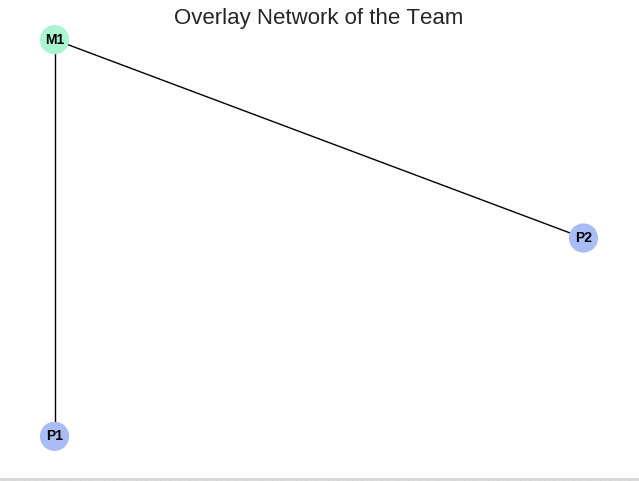
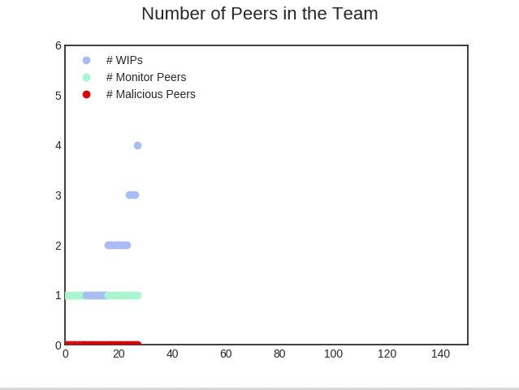
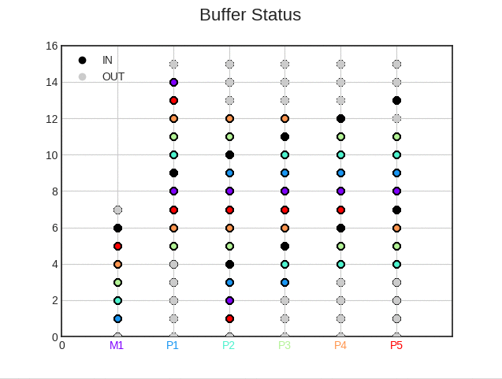

# P2PSP simulator

[](https://gitter.im/P2PSP/Simulator?utm_source=badge&utm_medium=badge&utm_campaign=pr-badge&utm_content=badge)

A complete stand-alone simulator of the P2PSP protocol using Processes and message passing in order to do the prototyping of new strategies easier.

# Pre-requisites
## Linux
```
$ pip3 install fire
$ pip3 install matplotlib
$ pip3 install networkx
```
### Arch
```
sudo pacman -S python-pmw
```

# Usage

## Running a simulation
```
$ python3 -u simulator.py run --set_of_rules SET_OF_RULES --number-of-monitors NUMBER_OF_MONITORS --number-of-peers NUMBER_OF_PEERS \
--number-of-malicious NUMBER_OF_MALICIOUS --number-of-rounds NUMBER_OF_ROUNDS --drawing-log FILENAME \
--set-of-rules SET_OF_RULES [--gui]
```

## Drawing the simulation
```
$ python3 simulator.py draw --drawing-log FILENAME
```

Note: If you want to draw in simulation time, you can add `--gui` option as a flag in the run command.

# Drawing file format
- First line -> experiment configuration:
```
C;[NumberOfMonitor];[NumberOfPeers];[NumberOfMalicious];[NumberOfRounds];[SetOfRules]
```
- Nodes -> `O;Node;[Direction];[NodeID]`. Example: `O;Node;IN;M1`
- Round -> `R;[Number]`
- Team Status -> `T;[NodeID];[Quantity];[RoundNumber]`
- Buffer Status (following lines are related)
  - Buffer -> `B;[NodeID];[C][L][...]. C-> Chunk, L -> Gap`
  - Sender -> `S;[NodeID];[NodeID][...]`
- Chunk Loss Ratio -> `CLR;[NodeID];[Value]`

# GUI

## Network Overlay
It shows how the network overlay evolves during the simulation.


**Nodes** represent the following entities:
- green: monitor/trusted peer (M/TPs)
- blue: regular peer (WIPs)
- red: malicious peer (MPs)

 
**Edges** represent the existence of communication (or not) among the nodes:
- black: there is communication
- red: there is not communication


## Team Status 
It shows the number of each type of peer into the team (same colors as used in Network Overlay).


## Buffer Status
Buffer status for each peer. Each point in the chart represents a chunk in the buffer of a peer:
- black: chunk from the splitter.
- gray: chunk consumed.
- others: chunk from other peers. One different color for each peer.


